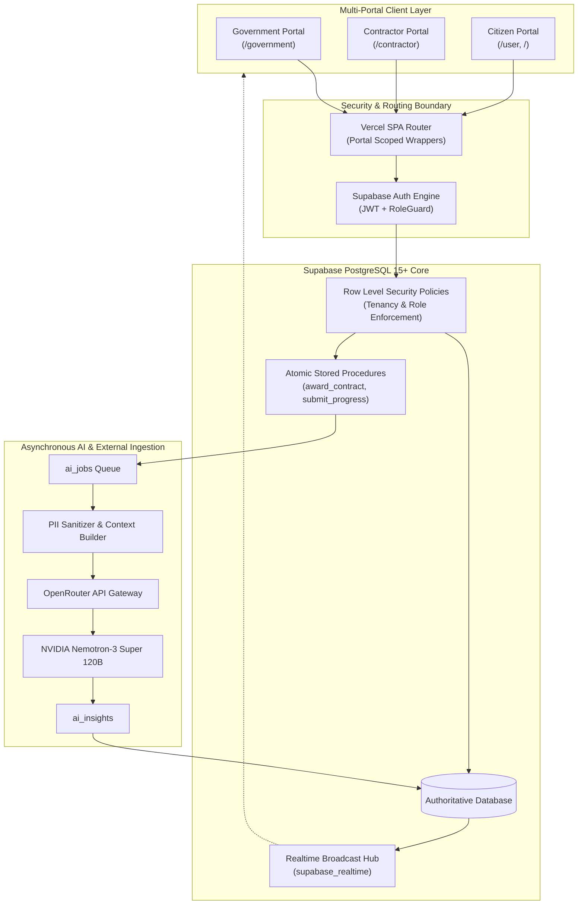
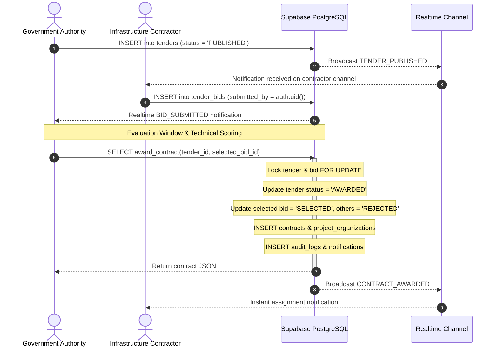
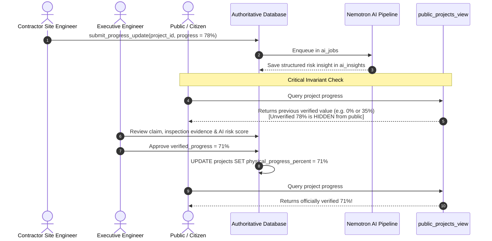
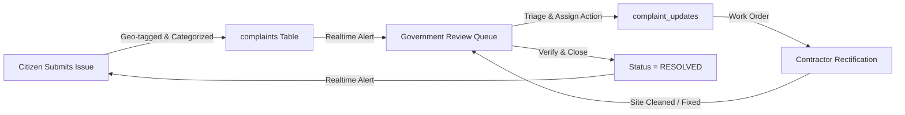

# NIRIKSHAK PLATFORM — SYSTEM ARCHITECTURE DIAGRAMS
**Format**: Edit-ready GitHub Flavored Mermaid Diagrams  
**Version**: 1.0.0  

---

## 1. Overall System Architecture

---

## 2. Tender $\rightarrow$ Bid $\rightarrow$ Contract Award Atomic Flow

---

## 3. Progress Verification & Official Progress Rule Invariant

---

## 4. Grievance Redressal Flow

